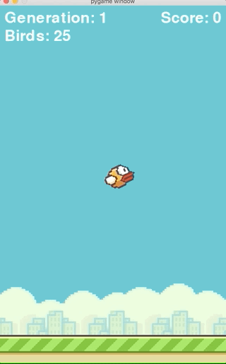

# Flappy Bird Reinforcement Learning
An implementation of the NEAT genetic algorithm to teach a computer to play 
Flappy Bird. Includes a playable version of Flappy Bird implemented in Python.

## References:

Inspired by and credits to https://github.com/techwithtim

Altered code of https://github.com/techwithtim/NEAT-Flappy-Bird

NEAT Algorithm and Python Implementation
- https://neat-python.readthedocs.io/en/latest/neat_overview.html
- http://nn.cs.utexas.edu/downloads/papers/stanley.ec02.pdf
